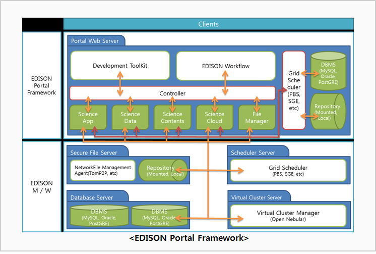
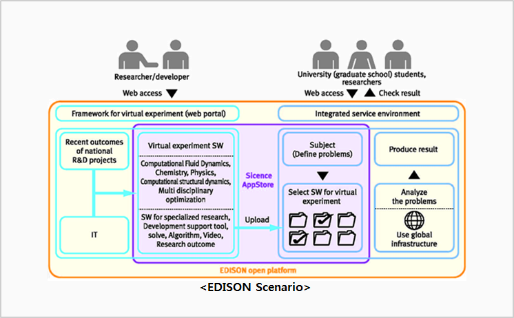

<h1>EDISON DOWNLOAD</h1>

Construction of EDISON open platform: the construction/ offering / support of integrated user of the Web portal service environment for simulation programs and content utilization of specialized field

provision of development and infrastructure resources of the EDISON application middleware: user authentication and management of tasks, building and EDISON user services infrastructure conjunction with the development and the super computer and high-speed research network resources provided

<h1>Documentation</h1>

<ul>
  <li><a href="https://www.edison.re.kr/documents/20181/222701/Installation_Guideline/3bc3531f-8a1b-4cf9-ac16-2934d560a35e">Project Installation Guideline</a></li>
</ul>

<h1>License</h1>

EDISON is free and open source and it always will be! It is licensed under the <a href="http://www.gnu.org/licenses/lgpl-2.1.html">GNU Lesser General Public License</a>.

